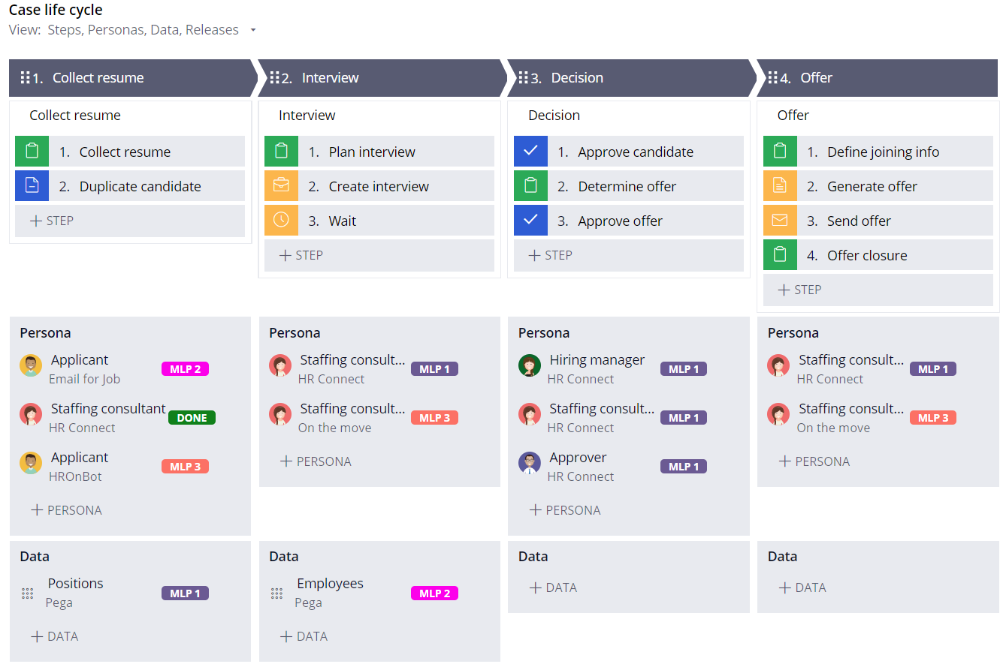

# Pega - Case Design Best Practices

## *Think of each Stage as a Microjourney

Using Directly Capture Objectives (DCO), the business architect, systems architect, and product owner collaborate to model the case type into stages and steps. This activity breaks down the case type into its component parts.

**To ensure case design best practices are adopted from the start, the system architect (SA) leads the technical design aspects of the case type within the DCO session.**

## The SA(Software Architect) makes sure that case design takes into account

- Workflow
- Personas and Channels
- Data
- Reuse
- Scale

## Another case design consideration is Work Allocation

There are two models for work allocation:

- Push model: In a push model, the system or a team manager manually assigns work to the appropriate user.
- Pull model: In a pull model, the user is assigned work automatically based on a set of business rules

personas are associated with stages within a case type to represent the persona's interaction during the case

## Case Type Design Example With Data and Personas mapped

