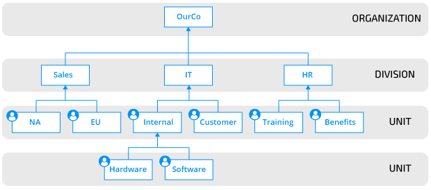

# Pega Cheat-Sheet

## This Sheet is organized by Access and Basic Understanding

### In General

Guide from academy.pega.com

This Image is an example of an Organization, Division, and Units

You should always map out an outline to follow. This should consist of
Users (Operators), each user's UI (Portals).

Pega consist of layers built on-top of each other
**The First layer is always Pega Platform and consist of the @baseClass rules**
On-top of the **@baseClass** we build **Frameworks** and **Applications**. We
can build applications on-top of existing applications or existing Frameworks.

**!Remember** when creating a new **FrameWork** or **Application** always click **Advanced** and check that your **Organization**, **Division** and **Unit**
are correct.

When Creating Stages try to line up each stage with the user needing to complete the **Steps** in that particular Stage. This will make it easy to line up Personas
and channels.

-----------------------------

## Logic

### Validations

### Declare Expressions

### Activities

Test

-----------------------------

## UI

**Harnesses** are layouts that are comprised of sections. You can create new layouts catered to users specific needs.
