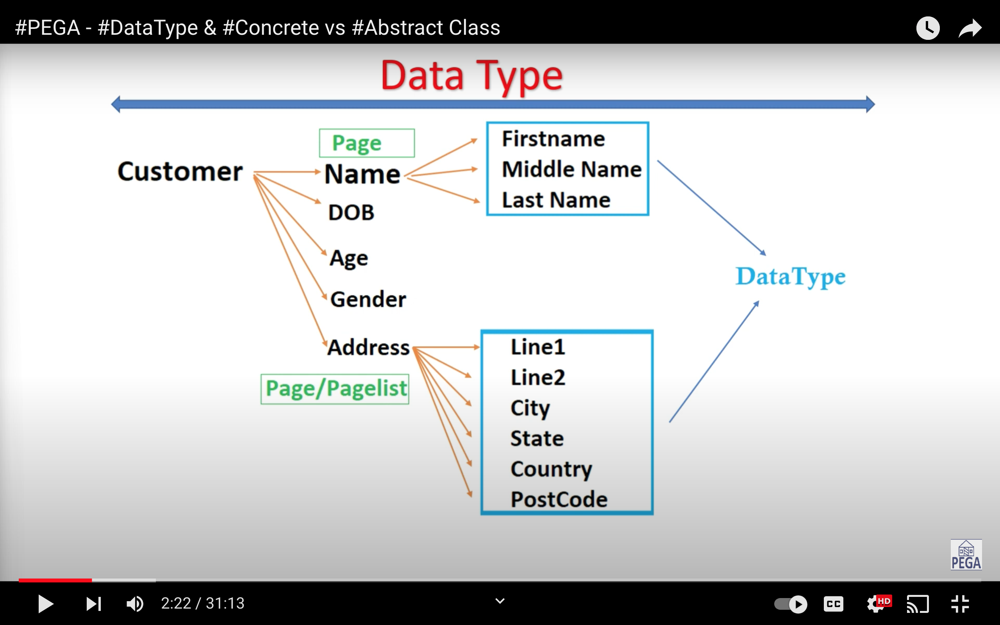

# Pega - Data Type

**Consist of one or more single-value fields, lists, or groups of fields. The fields define the data structure of the object.**

Fields = Properties

## How to envision data type

**Data Type example**

