# Pega - Declare Expressions

Declare Expression is one among the four main types of declarative rules in Pega which target a single property either to obtain its value or to validate the value. The declarative rules include:

**- Declare Expression**
**- Declare Onchange**
**- Declare Trigger - This gets auto executed when DB table Action performed.**
**- Constraints**
**- Declare Index - This gets auto executed when DB table Action performed.**
**- Declare Pages - Data Pages**

## What is a Declare Expression ?

Declare expression comes under the decision category and can be used to compute a value based on the expressions we create. The rules get triggered based on two methods:

## Forward Chaining -

By default, all declare expressions created work with forward chaining. Whenever an input changes, the target property gets calculated.

## Backward Chaining -

In Backward Chaining, whenever the target property is null or referred the declare expression is triggered and the target value gets calculated based on the expression.

Forward and backward chaining can be selected manually by using different options in the Change Tracking tab while creating Declare Expressions.

## Declare Expression Basics

1. Whenever inputs change - Forward Chaining

2. When used, if no value is present - Backward Chaining. The declare expression is triggered only if the target property we refer to is null.

3. When used, if the property is missing - Backward Chaining. The declare expression is triggered only if the target property we refer to is not present in the clipboard. If the property gets set in the clipboard the declare expression is never triggered again.

4. Whenever used - Backward Chaining. The declare expression is triggered whenever the target property is referred.

5. When applied by a Rule Collection - Declare expression is triggered when it gets invoked by a collection rule.

6. When invoked procedurally - Target property is calculated only if it is invoked by a collection rule.

————————————————————————————————------------------

### Configuring a declare expression using both forward and backward chaining techniques

1. Let us take the values of:

    Total price = Quantity * Price

    Grand total = Total price + Packaging Charge

2. Create a case type containing the properties above (Total Price, Quantity, Price, Grand total, Packaging Charge).
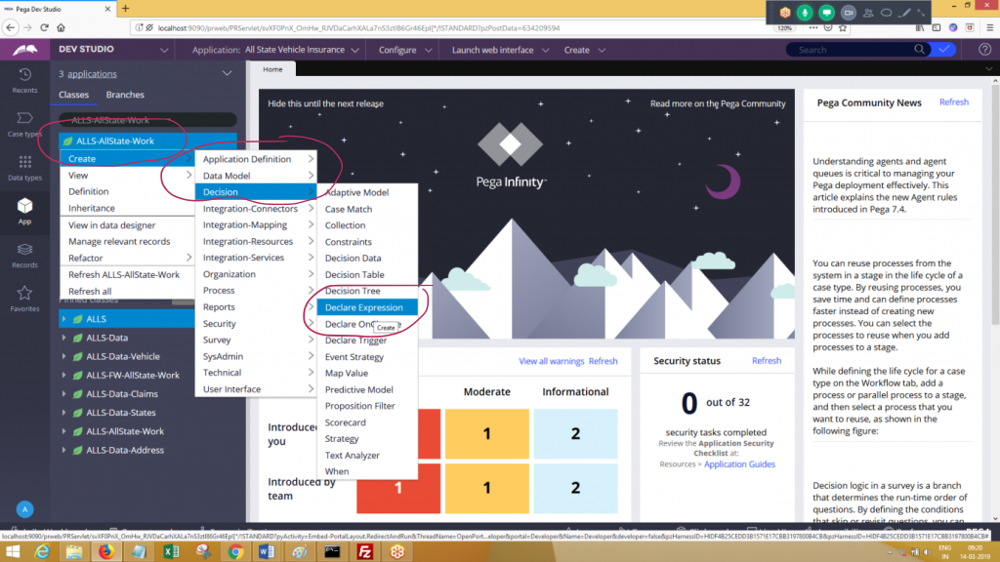

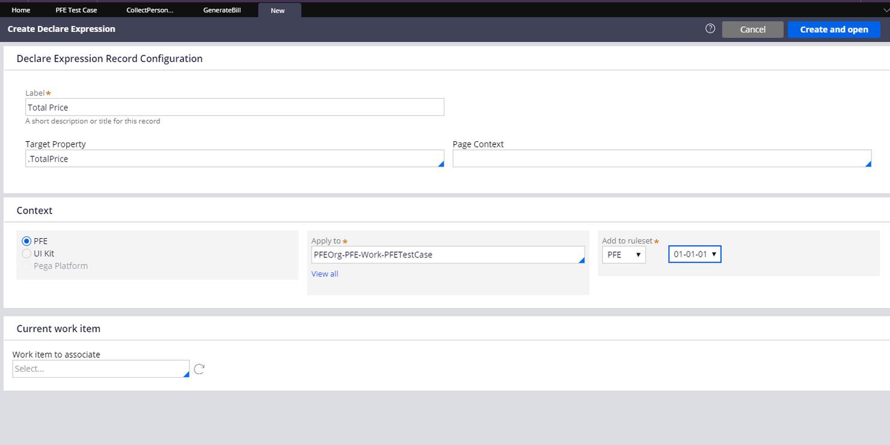
3. Click Create >> Decision >> DeclareExpression to create a declare expression for TotalPrice. Here TotalPrice is the target value.

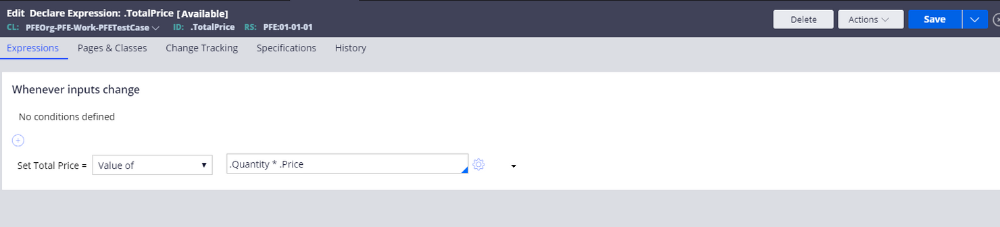
4. In the expressions tab, enter the expression.

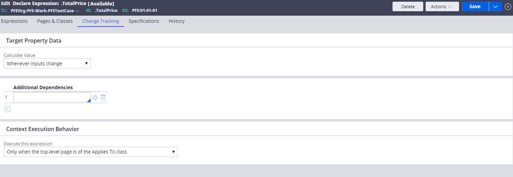
5. Go to Change Tracking tab to set when the declare expression has to be triggered. Select "Whenever inputs change" to enable forward chaining.
6. Save the expression.

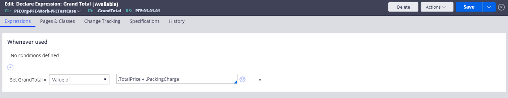
7. Create another declare expression with GrandTotal as target property.

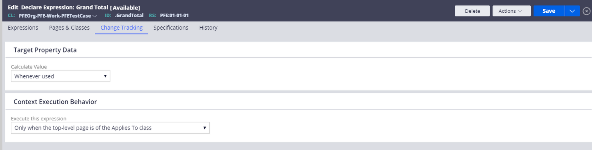
8. In the Change Tracking tab select "Whenever used" to trigger the declare expression only when the property is referred to. This enables backward chaining.
9. Save and run the case.

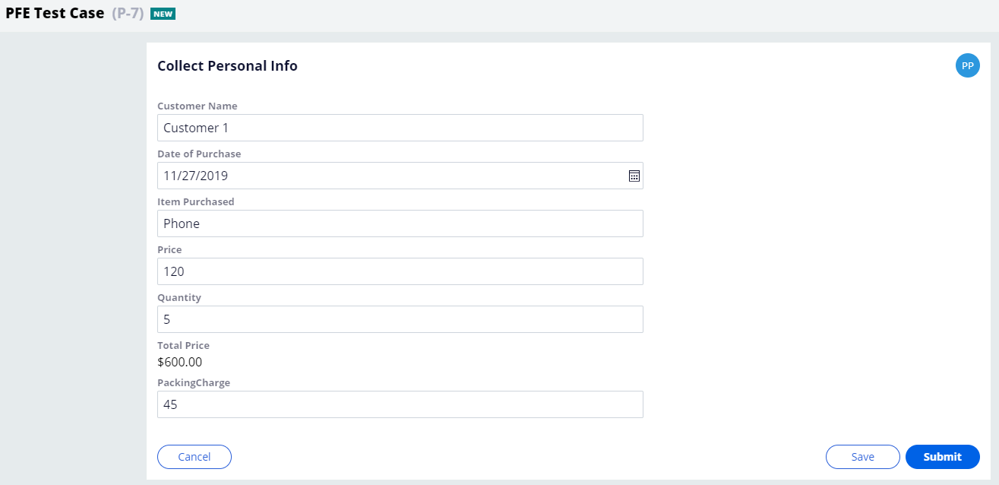
10. Here while running the case, the values are entered but are not submitted to check the functioning of forward chaining. You can see that the Total price value is changed each time you change either the Price value or the Quantity value.

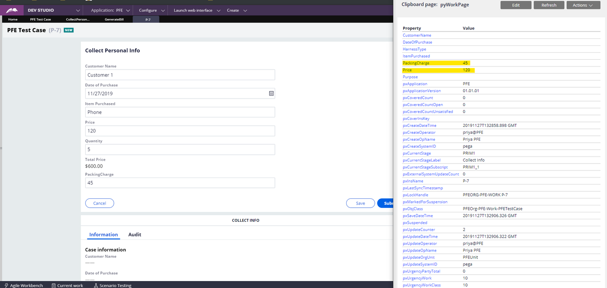
11. Open clipboard and open pyWorkPage to check if there is any value present in TotalPrice and GrandTotal properties.

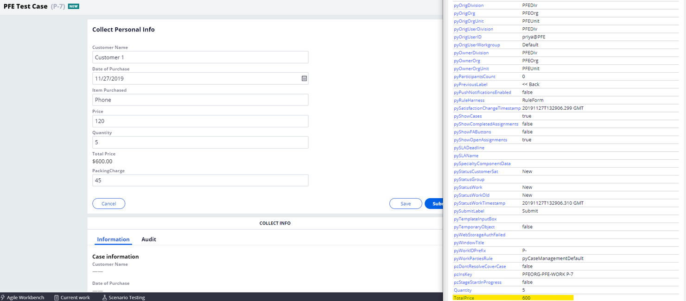
It can be seen that the value of TotalPrice is set but there is no GrandTotal Property even if the values required for its calculation are available. This is because the declare expression will be triggered only when the property is referred.

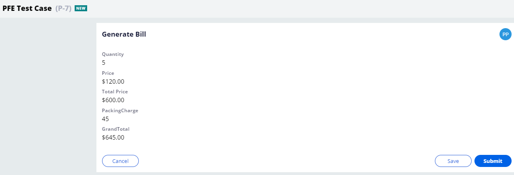
12. Click on Submit to submit the case. In the next screen, you can see that the Grand Total amount is calculated. This happens because when the GrandTotal property is referred, the Declare expression is triggered to calculate the value.

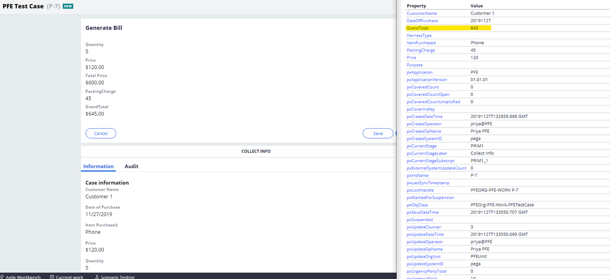
13. Open the clipboard to check if the value of GrandTotal is present.

We can find that the value of GrandTotal is set in the clipboard only when the target property is referred.
