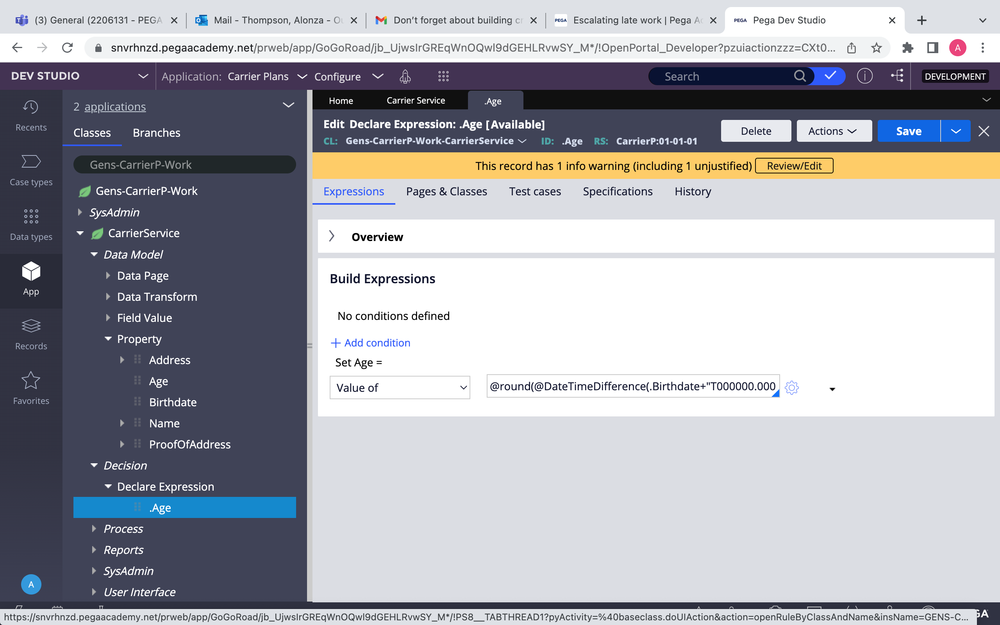

# Pega - Declare Expressions II

## Calculate Age Example

Needs two properties
Go to a step and configure view and add two properties.

1. Birthdate - type date only
2. Age - type integer

In the App explorer right-click on case > create > decision > declare expression

In the target or property box select age then create and open

In Build expression
Set Age = value of @round(@DateTimeDifference(.Birthdate+"T000000.000 GMT",@CurrentDateTime(),"Y")) +1

**It Should look like the example above.**

How the above Expression works.

@round() - method for rounding it’s a function
inside of @round we have the @DateTimeDifference()
we are rounding the DateTimeDifference of the Birthday entered
and the @CurrentDateTime()
As you can see the first parameter is the .BirthDate Property + “T000000.000 GMT” to format the property.
The second parameter is the @CurrentDate().
The third parameter is the part of the date we want which is the Year “Y”.
The +1 balances it all out.
