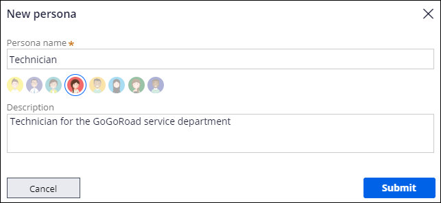
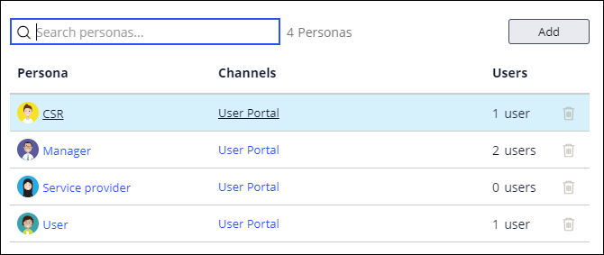
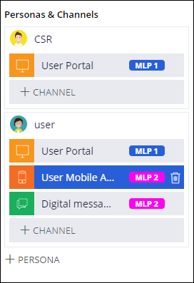

# Pega - Personas, Channels, Users

## Personas

**Personas - is the business representation of a type of user.**
Personas allow the organization to identify unique needs for application users, which could include different user interfaces to meet those needs. For example, an organization may define a persona to represent a technician, who needs a user interface that supports performing service tasks.

### Creating a New Persona

In App Studio add a new persona by clicking
**Users > User Management** and adding a **persona in the Persona tab**.Once the new persona is created, you can then assign it to users, as well as further configure the application to meet the persona's needs.


Default Persona is Users

Create additional personas when a unique combination of channel interface, responsibilities, permissions, and work routing requires differentiation from an existing persona.



Channel Interfaces

User Interfaces are also called channel interfaces.


User management

A user is an individual who interacts with an application. In App Studio, create a new user with an email address and assign them a persona or developer role by clicking Users > User management > People.
