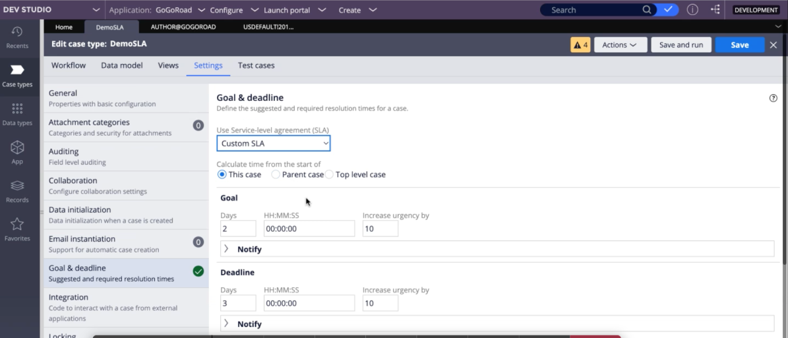

# Pega - SLA

## SERVICE LEVEL AGREEMENT

Are used to assure task are completed on schedule. An SLA is used to assist the working group in completing task promptly.
PRPC would keep records of every SLA rule’s performance of a specific event action defined for that rule. We can arrange the worklist depending on the task’s urgency. SLA’s make sure that service providers adhere to the same set of standards and
provide the same level of service.

SLA’s reduce the possibilities of customer dissatisfaction. SLA’s give you a way to get back at the company if they don’t meet
service requirements. Failing to meet duties can seriously impact a business reputation. Repercussions should be put in place if
company fails to meet requirements.

## SLA Example Screen 1

### Starts -

This is where the SLA time starts.

### Goal -

How long the task should take. It is calculated from the start of the case.

### Deadline -

Relates to the quantity of time a case or process can take before being late.
It Starts when the task starts.

### Passed Deadline -

Indicates when further action should be taken. Calculates how much time has passed
since an assignments dead line.

### Urgency -

Default urgency level starts at 10.

## Types of SLA’s in PEGA

### Assignment SLA-

Task-related SLA. Starts with assignment creation and ends with assignment fulfillment. The assignment urgency is controlled by pxUrgencyAssignSLA on the newly assigned page.

### Case level SLA -

This SLA is enforced during the duration of the case. Starts with the opening of a case and ends with its closing. It uses the standard attribute pySLAName. This SLA is identified on the WorkPage. The pxUrgencyWorkSLA property of the pyWorkPage class is being used to manage the timelines of case-level SLA.

### Stage level SLA -

Stage level SLA is known as SLA. A case’s life starts and end with a stage.
pxUrgencyWorkStageSLA property in pyWorkPage is often used to control the
urgency of stages.

### Step Level/ Flow Level SLA-

Referenced at the Step or Flow level. A step-level SLA begins when one task is initiated and when it is finished. It uses the attribute SLA. A step level SLA overrides a flow level SLA if present. Step level SLA can be seen on every step (can quickly be acted in the side panel when clicking on a step). A Flow level SLA us referred under the process tab.
