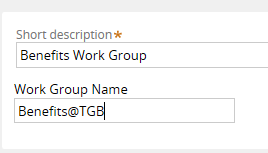
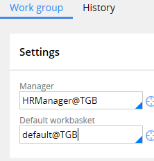
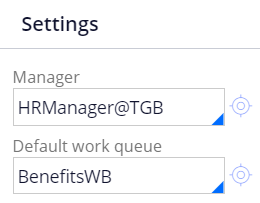
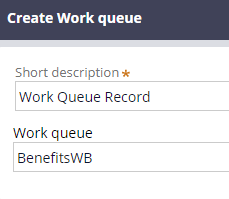
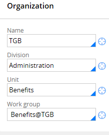

# Pega - Work Groups/Work Queues

## Pega Academy Page to show how to set up a Work Group and Work Queue below

## *Remember Work Queues must have Work Group

## Steps to create a Work Group and Work Queue

1. In Records Explorer, select **Organization > Work Group** and click **Create** to display the Create Work Group form
2. In the **Short description** field, enter a description
3. In the **Work Group Name** field, enter a work group name. Remember to use the **standard naming convention by adding an at symbol (@) and the organization name**. In the following example, the Work Group Name is **Benefits@TGB**.

4. Click **Create and Open**.
5. In the **Manager** field, on the **Work group tab**, in the Work Group form, select a work group manager.
6. In the **Default work queue** field, select a default work queue. In the following example, the work queue is the default for the organization, default@TGB.

7. Click **Save** to create the new work group.
8. In the **Default work queue** field, in the Work Group form, overwrite the value with the name of the new work queue. Use a naming convention that indicates the record is a work queue. In the following example, the new work queue is BenefitsWB. Later, you enter this name in the Create work queue form.

9. Click the **crosshairs** icon to open the Create work queue form.
10. In the **Short description** field, enter a description.
11. In the **Work queue** field, enter the name you entered in the Work Group form.

12. Click **Create and Open**.
13. On the work queue form, on the **Work queue** tab, select the required organization levels in the **Name, Division**, and **Unit** fields.
14. In the **Work group** field, select the work group you created.

15. Click **Save** to create the new work queue.
16. Return to the Work Group record and click **Save** to associate the new work queue with the work group.
